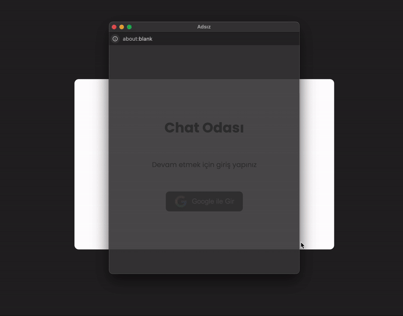
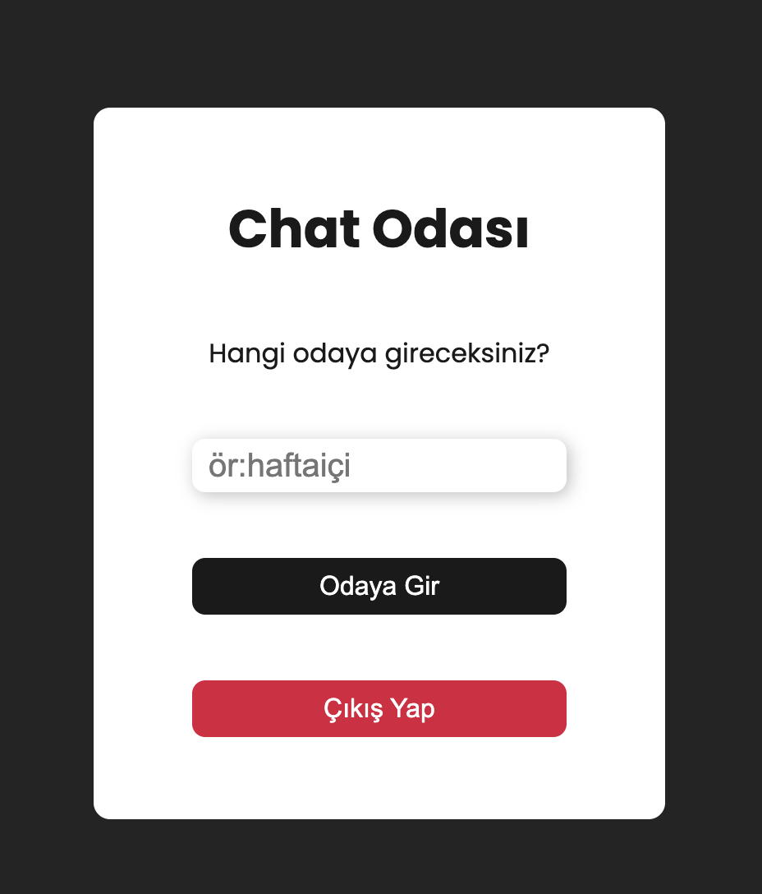
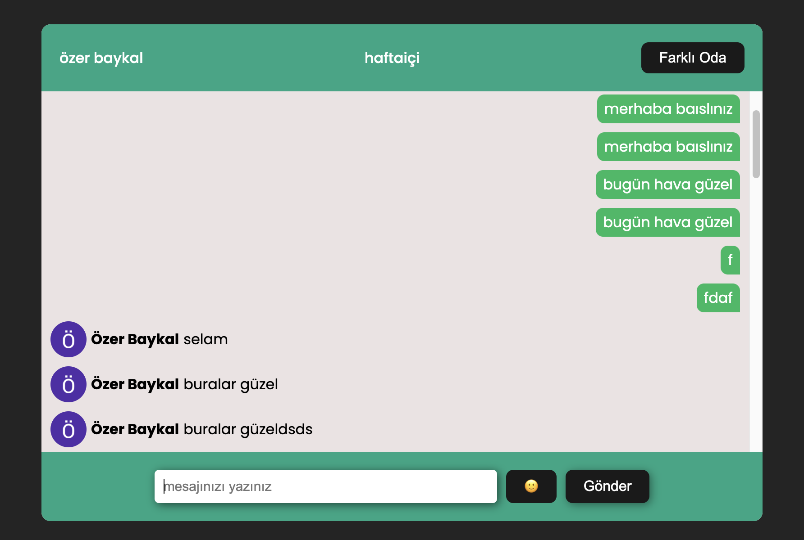

## Firebase Chat App


This is a real-time chat application built using Firebase as the backend. The application allows users to communicate with each other in real-time, leveraging Firebase's authentication and Firestore database for seamless data management.


<h2> Video gif</h2>



<h2>LoginPage</h2>



<h2>ChatRoomPage</h2>




## Table of Contents

- Features
- Technologies
- Setup Installation
- Usage
- Contributing
- Contact


## Features
- Real-time Messaging: Messages are instantly delivered to all participants.
- User Authentication: Firebase Authentication is used to handle user sign-up and login.
- Firestore Integration: Chat messages are stored in Firestore for real-time updates and persistence.
- Responsive Design: The app works smoothly on both mobile and desktop devices.
Firebase Hosting: The app is hosted on Firebase, ensuring a scalable and reliable infrastructure.

## Technologies 
The main technologies and libraries used in this project are:

- React: JavaScript library for building user interfaces
- Firebase:
   - Authentication for managing user login and sign-up.
  - Firestore for storing chat messages in real time.
  - Firebase Hosting for deploying the application.
- Sass: For advanced styling, modular CSS, and design consistency.
- emoji-picker-react: For integrating emoji selection in the chat interface.


 ##  Setup and Installation 

-  Clone the project to your local machine:
git clone https://github.com/ozerbaykal/firebase-chat-app.git

- Navigate to the project directory:
```
cd toolkit-flight-radar
```
-  Install the dependencies :
```
npm install
```
### or
 ```
 yarn install

```
Set up Firebase :
  - Go to Firebase Console.
  - Create a new project and enable Google Authentication, Firestore, and Cloud Storage.
  - Get your Firebase config details from the project settings.
  - Create a .env file in the root directory and add your Firebase configuration:

 -  Create a .env file in the root directory and add your Firebase configuration:
 
 ```
 
REACT_APP_FIREBASE_API_KEY=your-api-key
REACT_APP_FIREBASE_AUTH_DOMAIN=your-auth-domain
REACT_APP_FIREBASE_PROJECT_ID=your-project-id
REACT_APP_FIREBASE_STORAGE_BUCKET=your-storage-bucket
REACT_APP_FIREBASE_MESSAGING_SENDER_ID=your-messaging-sender-id
REACT_APP_FIREBASE_APP_ID=your-app-id

```
- Start the development server :

```
npm run dev

```

## Usage
- Sign Up/Login: Users can sign up or log in using Firebase Authentication.
- Chatroom: After logging in, users can join a chatroom and start sending/receiving messages in real time.
- Responsive Design: The app adapts to different screen sizes for a smooth experience across devices.


<h2>Contributing</h2>

Contributions are welcome! Please open an issue first to discuss what you would like to change.

- 1.Fork the project 
- 2.Create your feature branch (git checkout -b feature/NewFeature)
- 3.Commit your changes (git commit -m 'Add new feature')
- 4.Push to the branch (git push origin feature/NewFeature)
- 5.Open a Pull Request


<h2>Contact</h2>


Özer BAYKAL  mail : baykalozer87@gmail.com

Project Link: https://github.com/ozerbaykal/firebase-chat-app